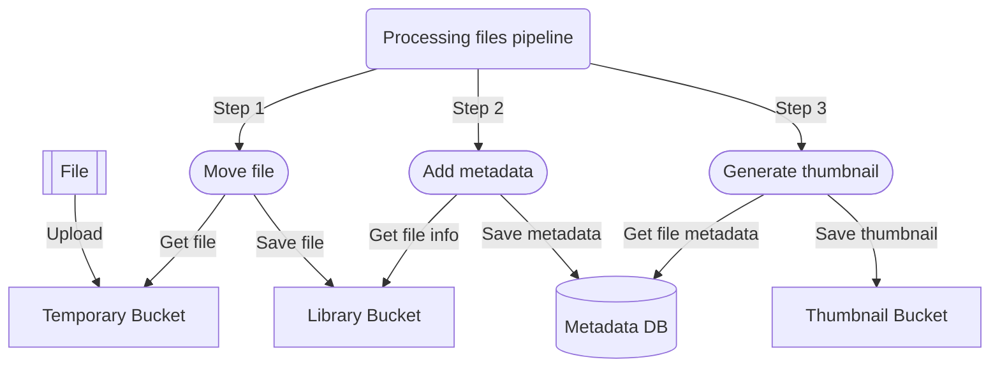

# Tag Files

### Files processing

```mermaid
flowchart TB
  file[[File]]
  library_bucket[Library Bucket]
  thumbnail_bucket[Thumbnail Bucket]
  temporary_bucket[Temporary Bucket]
  metadata_db[(Metadata DB)]

  files_processing(Processing files pipeline)
  move_file_step([Move file])
  add_metadata_step([Add metadata])
  generate_thumbnail_step([Generate thumbnail])

  file -->|Upload| temporary_bucket
  files_processing -->|Step 1| move_file_step
  files_processing -->|Step 2| add_metadata_step
  files_processing -->|Step 3| generate_thumbnail_step

  move_file_step -->|Get file| temporary_bucket
  move_file_step -->|Save file| library_bucket

  add_metadata_step -->|Get file info| library_bucket
  add_metadata_step -->|Save metadata| metadata_db

  generate_thumbnail_step -->|Get file metadata| metadata_db
  generate_thumbnail_step -->|Save thumbnail| thumbnail_bucket
```

### Local starting project

You need to create buckets with names: `temporary`, `library`, `thumbnail` in S3